# 🔄 에이전트 협업 워크플로우

> **작성일**: 2026-01-09 (v1.4 업데이트: 2026-01-11)
> **목적**: Claude Code 에이전트 간 효율적인 협업 프로세스 정의
> **에이전트 수**: 18개
> **워크플로우**: 11가지 + 요약 연계

---

## 📋 목차

1. [핵심 워크플로우](#핵심-워크플로우)
2. [워크플로우별 상세 가이드](#워크플로우별-상세-가이드)
3. [에이전트 역할 매트릭스](#에이전트-역할-매트릭스)
4. [트리거 조건](#트리거-조건)
5. [사용 시나리오](#사용-시나리오)

---

## 🎯 핵심 워크플로우

### 1️⃣ 코드 품질 관리 파이프라인 (필수)

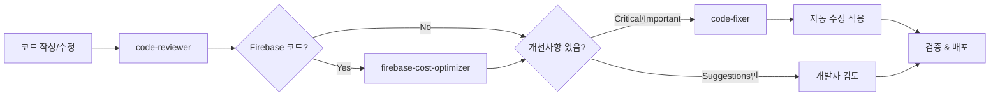

**실행 명령어 순서**:
```bash
1. code-reviewer 에이전트 실행 (코드 품질 검토)
2. firebase-cost-optimizer 에이전트 실행 (Firebase 코드 발견 시)
3. code-fixer 에이전트 실행 (자동 수정 적용)
```

**트리거 키워드**:
- "코드 점검", "코드 리뷰", "검토해줘", "체크해줘"

---

### 2️⃣ 버그 수정 워크플로우

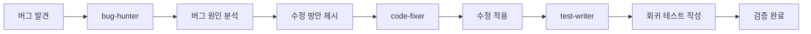

**실행 명령어 순서**:
```bash
1. bug-hunter 에이전트 실행 (버그 분석)
2. code-fixer 에이전트 실행 (수정 적용)
3. test-writer 에이전트 실행 (테스트 추가)
```

**트리거 키워드**:
- "버그", "에러", "오류", "bug", "error", "문제 발생"

---

### 3️⃣ 기능 개발 워크플로우

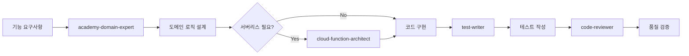

**실행 명령어 순서**:
```bash
1. academy-domain-expert 에이전트 실행 (도메인 설계)
2. cloud-function-architect 에이전트 실행 (필요 시)
3. [코드 작성]
4. test-writer 에이전트 실행 (테스트)
5. code-reviewer 에이전트 실행 (품질 검증)
```

**트리거 키워드**:
- "기능 추가", "새로운 기능", "구현해줘", "만들어줘"

---

### 4️⃣ 리팩토링 워크플로우

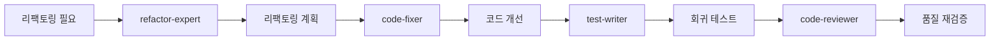

**실행 명령어 순서**:
```bash
1. refactor-expert 에이전트 실행 (리팩토링 설계)
2. code-fixer 에이전트 실행 (코드 수정)
3. test-writer 에이전트 실행 (회귀 테스트)
4. code-reviewer 에이전트 실행 (검증)
```

**트리거 키워드**:
- "리팩토링", "코드 개선", "최적화", "구조 개선"

---

### 5️⃣ 문서화 워크플로우

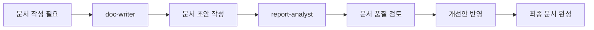

**실행 명령어 순서**:
```bash
1. doc-writer 에이전트 실행 (문서 작성)
2. report-analyst 에이전트 실행 (품질 검토)
3. doc-writer 에이전트 실행 (개선 반영)
```

**트리거 키워드**:
- "문서 작성", "README", "API 문서", "가이드"

---

### 6️⃣ 🆕 보안 점검 워크플로우

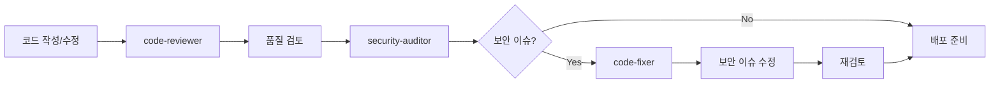

**실행 명령어 순서**:
```bash
1. code-reviewer 에이전트 실행 (기본 품질 검토)
2. security-auditor 에이전트 실행 (보안 취약점 검사)
3. code-fixer 에이전트 실행 (보안 이슈 수정)
4. [배포 진행]
```

**트리거 키워드**:
- "보안", "보안 검사", "취약점", "XSS", "인증", "개인정보", "배포 전 점검"

**언제 사용?**
- 배포 전 최종 점검
- 개인정보 관련 코드 수정 후
- 인증/권한 로직 변경 후
- Firebase Security Rules 변경 후

---

### 7️⃣ 🆕 알림 기능 개발 워크플로우

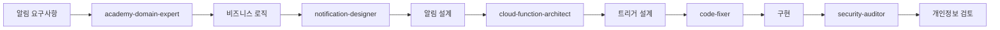

**실행 명령어 순서**:
```bash
1. academy-domain-expert 에이전트 실행 (비즈니스 요구사항)
2. notification-designer 에이전트 실행 (알림 채널/템플릿 설계)
3. cloud-function-architect 에이전트 실행 (트리거 설계)
4. code-fixer 에이전트 실행 (구현)
5. security-auditor 에이전트 실행 (개인정보 보호 검토)
```

**트리거 키워드**:
- "알림", "푸시", "SMS", "카카오", "알림톡", "메시지 발송"

**언제 사용?**
- 새로운 알림 기능 추가 시
- 알림 채널 변경/추가 시
- 알림 비용 최적화 필요 시
- 학부모/학생 알림 시스템 구축 시

---

### 8️⃣ 🆕 데이터 분석 워크플로우

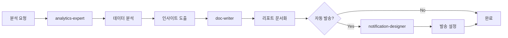

**실행 명령어 순서**:
```bash
1. analytics-expert 에이전트 실행 (데이터 분석)
2. doc-writer 에이전트 실행 (리포트 문서화)
3. notification-designer 에이전트 실행 (자동 발송 설정, 선택)
```

**트리거 키워드**:
- "통계", "분석", "리포트", "대시보드", "KPI", "현황", "추이"

**언제 사용?**
- 정기 리포트 생성 (주간/월간)
- 의사결정용 데이터 필요 시
- 대시보드 설계 시
- 운영 현황 파악 시

---

### 9️⃣ 🆕 TDD 개발 워크플로우

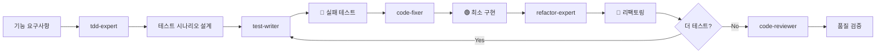

**실행 명령어 순서**:
```bash
1. tdd-expert 에이전트 실행 (테스트 시나리오 설계)
2. test-writer 에이전트 실행 (🔴 실패 테스트 작성)
3. code-fixer 에이전트 실행 (🟢 최소 구현)
4. refactor-expert 에이전트 실행 (🔵 리팩토링)
5. 반복 (2~4)
6. code-reviewer 에이전트 실행 (최종 검증)
```

**트리거 키워드**:
- "TDD", "테스트 먼저", "테스트 주도", "RED GREEN", "테스트 설계"

**언제 사용?**
- 새로운 기능을 TDD 방식으로 개발할 때
- 테스트 커버리지를 높이고 싶을 때
- 안정적인 코드 품질이 필요할 때

---

### 🔟 🆕 디자인 시스템 점검 워크플로우

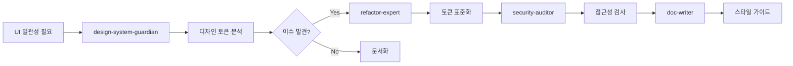

**실행 명령어 순서**:
```bash
1. design-system-guardian 에이전트 실행 (디자인 토큰 분석)
2. refactor-expert 에이전트 실행 (토큰 표준화)
3. security-auditor 에이전트 실행 (접근성 검사)
4. doc-writer 에이전트 실행 (스타일 가이드 작성)
```

**트리거 키워드**:
- "디자인 시스템", "UI 일관성", "색상 팔레트", "타이포그래피", "접근성"

**언제 사용?**
- UI 일관성 문제가 발생했을 때
- 새로운 디자인 시스템을 구축할 때
- 접근성(A11y) 개선이 필요할 때
- 디자인 토큰을 정리하고 싶을 때

---

### 1️⃣1️⃣ 🆕 데이터 마이그레이션 워크플로우

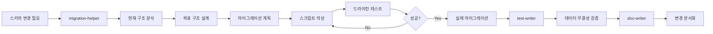

**실행 명령어 순서**:
```bash
1. migration-helper 에이전트 실행 (스키마 분석 및 계획)
2. migration-helper 에이전트 실행 (스크립트 작성)
3. 드라이런 테스트 실행 (DRY_RUN=true)
4. 실제 마이그레이션 실행
5. test-writer 에이전트 실행 (기능 테스트)
6. doc-writer 에이전트 실행 (변경사항 문서화)
```

**트리거 키워드**:
- "마이그레이션", "데이터 이전", "스키마 변경", "구조 통일", "데이터 변환"

**언제 사용?**
- Firestore 데이터 구조를 변경할 때
- 레거시 데이터를 새 형식으로 변환할 때
- 여러 컬렉션의 구조를 통일할 때
- 하위 호환성을 유지하며 점진적 마이그레이션할 때

---

### 🆕 요약 연계 (report-summarizer)

모든 리포트 생성 에이전트는 `report-summarizer`와 연계할 수 있습니다.

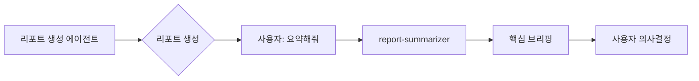

**지원하는 에이전트**:
| 에이전트 | 요약 예시 |
|---------|----------|
| code-reviewer | "🟡 Critical 2건, Important 5건. 즉시 수정: StudentList.tsx" |
| security-auditor | "🔴 배포 불가. XSS 1건 즉시 수정 필요" |
| analytics-expert | "🟢 매출 5,230만(+8.9%), 재원생 102명(+5). 미수금 180만 주의" |
| firebase-cost-optimizer | "💰 월 15,000원 → 최적화 시 4,500원(-70%)" |
| bug-hunter | "🐛 근본 원인: useEffect 의존성 누락. 위치: StudentList.tsx:45" |
| refactor-expert | "🔄 3단계 리팩토링 필요. 우선순위: 컴포넌트 분리 → 훅 추출" |

**사용 방법**:
```bash
# 방법 1: 체인 요청 (처음부터)
"코드 리뷰하고 요약해줘"
→ code-reviewer 실행 → report-summarizer 자동 연결

# 방법 2: 후속 요청 (리포트 생성 후)
[리포트 생성 완료]
"요약해줘" 또는 "핵심만" 또는 "한줄로"
→ report-summarizer 실행
```

**트리거 키워드**:
- "요약", "요약해줘", "핵심만", "간단히", "브리핑", "정리해줘", "한줄로", "결론만"

---

## 📊 워크플로우별 상세 가이드

### 워크플로우 1: 코드 품질 관리 (가장 자주 사용)

#### 📍 언제 사용?
- 새로운 코드 작성 후
- 기존 코드 수정 후
- PR 제출 전
- 정기적인 코드 점검 시

#### 🎯 목표
- 코드 품질 향상
- Firebase 비용 최적화
- 베스트 프랙티스 적용
- 자동화된 개선

#### 📝 실행 예시

**Step 1: code-reviewer 실행**
```
사용자: "src/components/StudentList.tsx 파일 코드 리뷰해줘"
→ code-reviewer 자동 실행
→ 품질 검토 리포트 생성
```

**Step 2: firebase-cost-optimizer 실행 (조건부)**
```
code-reviewer가 Firestore 쿼리 발견 시 자동 호출
→ 비용 분석 리포트 생성
→ 최적화 권장사항 제시
```

**Step 3: code-fixer 실행**
```
사용자: "리뷰 피드백 반영해서 수정해줘"
→ code-fixer 자동 실행
→ Critical/Important 이슈 자동 수정
→ 검증 및 리포트 생성
```

#### ✅ 완료 기준
- [ ] ESLint 에러 0개
- [ ] TypeScript 에러 0개
- [ ] Firebase 비용 최적화 완료
- [ ] 모든 Critical 이슈 해결
- [ ] 테스트 통과

---

### 워크플로우 2: 버그 수정

#### 📍 언제 사용?
- 버그 리포트 접수 시
- 에러 로그 발견 시
- 사용자 불만 접수 시
- QA 테스트 실패 시

#### 🎯 목표
- 버그 근본 원인 파악
- 안전한 수정 적용
- 재발 방지 테스트 추가

#### 📝 실행 예시

**Step 1: bug-hunter 실행**
```
사용자: "출석 체크 시 에러 발생하는데 원인 찾아줘"
→ bug-hunter 실행
→ 에러 메시지 분석
→ 스택 트레이스 추적
→ 근본 원인 식별
→ 수정 방안 제시
```

**Step 2: code-fixer 실행**
```
사용자: "버그 수정해줘"
→ bug-hunter의 수정 방안 적용
→ 관련 코드 수정
→ 검증
```

**Step 3: test-writer 실행**
```
사용자: "이 버그에 대한 회귀 테스트 작성해줘"
→ test-writer 실행
→ 버그 재현 테스트 작성
→ 수정 후 테스트 통과 확인
```

#### ✅ 완료 기준
- [ ] 버그 근본 원인 파악
- [ ] 수정 완료 및 검증
- [ ] 회귀 테스트 추가
- [ ] 관련 문서 업데이트

---

### 워크플로우 3: 기능 개발

#### 📍 언제 사용?
- 새로운 기능 추가 시
- 기존 기능 확장 시
- 학원 관리 시스템 기능 설계 시

#### 🎯 목표
- 도메인 로직 정확성
- 확장 가능한 아키텍처
- 안정적인 서버리스 구현
- 포괄적인 테스트

#### 📝 실행 예시

**Step 1: academy-domain-expert 실행**
```
사용자: "학생 출석률 자동 계산 기능 설계해줘"
→ academy-domain-expert 실행
→ 도메인 모델 설계
→ 비즈니스 로직 제시
→ 데이터 구조 권장
```

**Step 2: cloud-function-architect 실행 (필요 시)**
```
사용자: "이 기능을 Cloud Function으로 구현하려면?"
→ cloud-function-architect 실행
→ 트리거 설계
→ 멱등성 보장 방안
→ 비용 최적화 전략
```

**Step 3: 코드 구현**
```
[개발자가 직접 코드 작성 또는 AI 지원 코딩]
```

**Step 4: test-writer 실행**
```
사용자: "작성한 코드에 대한 테스트 작성해줘"
→ test-writer 실행
→ 단위 테스트 작성
→ 통합 테스트 작성
→ Edge case 커버
```

**Step 5: code-reviewer 실행**
```
사용자: "전체 코드 점검해줘"
→ 워크플로우 1 실행 (코드 품질 관리)
```

#### ✅ 완료 기준
- [ ] 도메인 로직 정확성 검증
- [ ] 코드 구현 완료
- [ ] 테스트 커버리지 80% 이상
- [ ] 코드 리뷰 통과
- [ ] Firebase 비용 최적화

---

### 워크플로우 4: 리팩토링

#### 📍 언제 사용?
- 코드 복잡도가 높아질 때
- 기술 부채 해소 시
- 성능 개선 필요 시
- 코드 중복 제거 시

#### 🎯 목표
- 코드 가독성 향상
- 유지보수성 개선
- 성능 최적화
- 기능 보존 (중요!)

#### ✅ 완료 기준
- [ ] 기능 100% 보존
- [ ] 코드 복잡도 감소
- [ ] 성능 개선 (또는 동일)
- [ ] 모든 테스트 통과
- [ ] 문서 업데이트

---

### 워크플로우 5: 문서화

#### 📍 언제 사용?
- 새로운 기능 완성 후
- API 변경 시
- README 작성/업데이트 시
- 보고서 작성 시

#### 🎯 목표
- 명확한 문서 작성
- 높은 가독성
- 완전한 정보 제공
- 지속적인 품질 유지

#### ✅ 완료 기준
- [ ] 모든 필수 정보 포함
- [ ] 예시 코드 작동 확인
- [ ] 가독성 검증 완료
- [ ] 오타/문법 오류 0개
- [ ] 링크 유효성 확인

---

### 워크플로우 6: 🆕 보안 점검

#### 📍 언제 사용?
- 배포 전 최종 점검
- 개인정보 관련 코드 수정 후
- 인증/권한 로직 변경 후
- Firebase Security Rules 변경 후

#### 🎯 목표
- 보안 취약점 제거
- 개인정보 보호 강화
- 안전한 배포

#### 📝 실행 예시

**Step 1: code-reviewer 실행**
```
사용자: "배포 전 코드 점검해줘"
→ code-reviewer 실행
→ 기본 품질 검토
```

**Step 2: security-auditor 실행**
```
사용자: "보안 검사해줘"
→ security-auditor 실행
→ XSS/CSRF 취약점 검사
→ 인증/인가 검토
→ 개인정보 노출 검사
→ Firebase Security Rules 검토
```

**Step 3: code-fixer 실행 (이슈 발견 시)**
```
사용자: "보안 이슈 수정해줘"
→ code-fixer 실행
→ Critical 보안 이슈 수정
→ 재검증
```

#### ✅ 완료 기준
- [ ] XSS 취약점 0개
- [ ] CSRF 취약점 0개
- [ ] 인증/인가 검증 완료
- [ ] 개인정보 암호화 확인
- [ ] API 키 노출 없음
- [ ] Firebase Security Rules 적절함

---

### 워크플로우 7: 🆕 알림 기능 개발

#### 📍 언제 사용?
- 새로운 알림 기능 추가 시
- 알림 채널 변경/추가 시
- 알림 비용 최적화 필요 시
- 학부모/학생 알림 시스템 구축 시

#### 🎯 목표
- 효과적인 알림 전달
- 적절한 채널 선택
- 비용 최적화
- 개인정보 보호

#### 📝 실행 예시

**Step 1: academy-domain-expert 실행**
```
사용자: "학부모에게 출결 알림 보내는 기능 설계해줘"
→ academy-domain-expert 실행
→ 비즈니스 요구사항 정리
→ 알림 시점/대상 정의
```

**Step 2: notification-designer 실행**
```
사용자: "알림 채널과 템플릿 설계해줘"
→ notification-designer 실행
→ 채널 선택 (푸시/카카오/SMS)
→ 메시지 템플릿 설계
→ 비용 분석
```

**Step 3: cloud-function-architect 실행**
```
사용자: "Cloud Function 트리거 설계해줘"
→ cloud-function-architect 실행
→ 트리거 설계 (onCreate/onUpdate/scheduled)
→ 발송 로직 설계
```

**Step 4: code-fixer 실행**
```
사용자: "알림 기능 구현해줘"
→ code-fixer 실행
→ 코드 구현
```

**Step 5: security-auditor 실행**
```
사용자: "개인정보 노출 검사해줘"
→ security-auditor 실행
→ 수신자 정보 보호 확인
→ 알림 내용 개인정보 검토
```

#### ✅ 완료 기준
- [ ] 알림 채널 선택 완료
- [ ] 메시지 템플릿 승인 (카카오 등)
- [ ] Cloud Function 트리거 설정
- [ ] 개인정보 보호 확인
- [ ] 비용 예측 완료
- [ ] 테스트 발송 성공

---

### 워크플로우 8: 🆕 데이터 분석

#### 📍 언제 사용?
- 정기 리포트 생성 (주간/월간)
- 의사결정용 데이터 필요 시
- 대시보드 설계 시
- 운영 현황 파악 시

#### 🎯 목표
- 정확한 데이터 분석
- 실행 가능한 인사이트
- 효과적인 시각화
- 자동화된 리포트

#### 📝 실행 예시

**Step 1: analytics-expert 실행**
```
사용자: "이번 달 매출 분석해줘"
→ analytics-expert 실행
→ KPI 정의
→ 데이터 쿼리 설계
→ 분석 결과 제시
→ 인사이트 도출
```

**Step 2: doc-writer 실행**
```
사용자: "분석 결과를 리포트로 만들어줘"
→ doc-writer 실행
→ 리포트 문서화
→ 차트/그래프 포함
```

**Step 3: notification-designer 실행 (선택)**
```
사용자: "매주 자동으로 리포트 발송하고 싶어"
→ notification-designer 실행
→ 자동 발송 스케줄 설정
→ 수신자 목록 설정
```

#### ✅ 완료 기준
- [ ] KPI 정의 완료
- [ ] 데이터 쿼리 작성
- [ ] 분석 결과 검증
- [ ] 리포트 문서화
- [ ] (선택) 자동 발송 설정

---

## 🗂️ 에이전트 역할 매트릭스

### 전체 에이전트 목록과 역할

| 에이전트 | 주요 역할 | 입력 | 출력 | 다음 단계 |
|---------|----------|------|------|----------|
| **academy-domain-expert** | 학원 도메인 설계 | 기능 요구사항 | 도메인 모델, 비즈니스 로직 | cloud-function-architect / notification-designer |
| **bug-hunter** | 버그 분석 | 에러 메시지, 증상 | 원인 분석, 수정 방안 | code-fixer |
| **cloud-function-architect** | 서버리스 설계 | 기능 요구사항 | Cloud Function 설계 | 코드 구현 |
| **code-fixer** | 자동 수정 | 리뷰 피드백 | 수정된 코드 | 검증 |
| **code-reviewer** | 코드 품질 검토 | 소스 코드 | 리뷰 리포트 | firebase-cost-optimizer / security-auditor / code-fixer |
| **doc-writer** | 문서 작성 | 코드, 기능 설명 | README, API 문서 | report-analyst |
| **firebase-cost-optimizer** | 비용 최적화 | Firestore 쿼리 | 비용 분석, 최적화 권장 | code-fixer |
| **refactor-expert** | 리팩토링 | 기존 코드 | 리팩토링 계획 | code-fixer |
| **report-analyst** | 문서 검토 | 마크다운 문서 | 개선안 | doc-writer |
| **test-writer** | 테스트 작성 | 소스 코드 | 테스트 코드 | code-reviewer |
| **security-auditor** | 보안 검사 | 소스 코드 | 보안 리포트 | code-fixer |
| **notification-designer** | 알림 설계 | 알림 요구사항 | 알림 설계서 | cloud-function-architect |
| **analytics-expert** | 데이터 분석 | 분석 요청 | 분석 리포트, 대시보드 설계 | doc-writer |
| **report-summarizer** | 리포트 요약 | 긴 리포트/문서 | 핵심 브리핑 | 의사결정 |
| 🆕 **tdd-expert** | TDD 사이클 관리 | 기능 요구사항 | 테스트 시나리오, 커버리지 분석 | test-writer / code-fixer |
| 🆕 **design-system-guardian** | UI 일관성 점검 | 컴포넌트/스타일 | 디자인 토큰 분석, 개선안 | refactor-expert / doc-writer |
| 🆕 **performance-optimizer** | 성능 분석/최적화 | 소스 코드, 번들 | 성능 리포트, 최적화 권장 | refactor-expert / code-fixer |
| 🆕 **migration-helper** | 데이터 마이그레이션 | 스키마 변경 요청 | 마이그레이션 계획/스크립트 | test-writer / doc-writer |

---

### 협업 관계 매트릭스

| From ↓ / To → | academy | bug | cloud | fixer | reviewer | doc | firebase | refactor | report | test | security | notif | analytics | tdd | design | perf | migrate |
|--------------|---------|-----|-------|-------|----------|-----|----------|----------|--------|------|----------|-------|-----------|-----|--------|------|---------|
| **academy-domain-expert** | - | | ✅ | | | ✅ | | | | | | ✅ | | | | | ✅ |
| **bug-hunter** | | - | | ✅ | | | | | | ✅ | | | | | | | |
| **cloud-function-architect** | | | - | ✅ | | ✅ | | | | | | | | | | | |
| **code-fixer** | | | | - | ✅ | | | | | | | | | | | | |
| **code-reviewer** | | | | ✅ | - | | ✅ | | | | ✅ | | | | | ✅ | |
| **doc-writer** | | | | | | - | | | ✅ | | | | | | | | |
| **firebase-cost-optimizer** | | | | ✅ | | | - | | | | | | | | | ✅ | |
| **refactor-expert** | | | | ✅ | | | | - | | ✅ | | | | | ✅ | | |
| **report-analyst** | | | | | | ✅ | | | - | | | | | | | | |
| **test-writer** | | | | | ✅ | | | | | - | | | | ✅ | | | |
| **security-auditor** | | | | ✅ | | | | | | | - | | | | ✅ | | |
| **notification-designer** | | | ✅ | ✅ | | | | | | | ✅ | - | | | | | |
| **analytics-expert** | | | | | | ✅ | | | | | | ✅ | - | | | | |
| 🆕 **tdd-expert** | | | | ✅ | ✅ | | | ✅ | | ✅ | | | | - | | | |
| 🆕 **design-system-guardian** | | | | | | ✅ | | ✅ | | | ✅ | | | | - | | |
| 🆕 **performance-optimizer** | | | | ✅ | | | ✅ | ✅ | | | | | | | | - | |
| 🆕 **migration-helper** | | | | | | ✅ | | | | ✅ | | | | | | | - |

✅ = 직접 협업 관계

---

## 🔔 트리거 조건

### 자동 트리거가 설정된 에이전트

| 에이전트 | 트리거 유형 | 트리거 조건 |
|---------|-----------|-----------|
| **code-reviewer** | `trigger_on_code_review: true` | "코드 점검", "코드 리뷰", "검토", "체크" |
| **firebase-cost-optimizer** | `trigger_on_firebase_code: true` | Firestore 코드 발견 시 |
| **code-fixer** | `trigger_after_code_review: true` | code-reviewer가 Critical/Important 이슈 발견 시 |
| **cloud-function-architect** | `trigger_on_phrases` | "Cloud Function", "클라우드 펑션", "서버리스", "트리거" |
| **bug-hunter** | `trigger_on_phrases` | "버그", "에러", "오류", "bug", "error", "문제 발생" |
| **test-writer** | `trigger_after_refactoring: true` | refactor-expert 실행 후, 새 기능 구현 후 |
| **doc-writer** | `trigger_on_new_features: true` | 새 기능 완성 후, API 변경 시 |
| **refactor-expert** | `trigger_on_complexity_threshold: true` | 복잡도 임계값 초과 시 |
| **report-analyst** | `trigger_on_file_extension: [".md"]` | .md 파일 업로드 시 |
| **security-auditor** | `trigger_before_deployment: true` | "보안", "취약점", "배포 전", "개인정보" |
| **notification-designer** | `trigger_on_domain_features: true` | "알림", "푸시", "SMS", "카카오", "알림톡" |
| **analytics-expert** | `trigger_on_domain_features: true` | "통계", "분석", "리포트", "대시보드", "KPI" |
| 🆕 **tdd-expert** | `trigger_on_phrases` | "TDD", "테스트 먼저", "테스트 주도", "RED GREEN", "테스트 설계" |
| 🆕 **design-system-guardian** | `trigger_on_phrases` | "디자인 시스템", "UI 일관성", "색상 팔레트", "타이포그래피", "접근성" |
| 🆕 **performance-optimizer** | `trigger_on_phrases` | "성능 분석", "성능 최적화", "느림", "로딩 시간", "번들 크기", "Lighthouse" |
| 🆕 **migration-helper** | `trigger_on_phrases` | "마이그레이션", "데이터 이전", "스키마 변경", "구조 통일", "데이터 변환" |

---

## 💡 사용 시나리오

### 시나리오 1: 출석 관리 기능 추가

```
[상황] 학생 출석을 자동으로 집계하는 기능 추가 필요

Step 1: "학생 출석 자동 집계 기능 설계해줘"
→ academy-domain-expert 실행
→ 도메인 모델 제시

Step 2: "이 기능을 Cloud Function으로 구현하려면?"
→ cloud-function-architect 실행
→ onCreate 트리거 설계 제시

Step 3: [코드 구현]

Step 4: "구현한 코드 테스트 작성해줘"
→ test-writer 실행
→ 단위/통합 테스트 생성

Step 5: "전체 코드 점검해줘"
→ code-reviewer 실행
→ firebase-cost-optimizer 자동 실행
→ code-fixer 실행 (필요 시)

Step 6: "API 문서 작성해줘"
→ doc-writer 실행
→ report-analyst 실행 (검토)
```

---

### 시나리오 2: 성능 저하 문제 해결

```
[상황] 학생 목록 로딩이 느려짐

Step 1: "학생 목록 로딩 느린 문제 분석해줘"
→ bug-hunter 실행
→ 원인: 전체 컬렉션 조회 + 페이지네이션 없음

Step 2: "Firebase 비용도 같이 확인해줘"
→ firebase-cost-optimizer 실행
→ 비용 핫스팟 발견

Step 3: "최적화 방안 적용해줘"
→ code-fixer 실행
→ 페이지네이션 추가
→ React Query 캐싱 적용

Step 4: "최적화 후 테스트 작성해줘"
→ test-writer 실행

Step 5: "최종 검증"
→ code-reviewer 실행
```

---

### 시나리오 3: 🆕 학부모 출결 알림 기능 개발

```
[상황] 학부모에게 자녀 출결 알림을 보내는 기능 필요

Step 1: "학부모에게 출결 알림 보내는 기능 설계해줘"
→ academy-domain-expert 실행
→ 비즈니스 요구사항 정리 (언제, 누구에게, 어떤 정보)

Step 2: "알림 채널과 템플릿 설계해줘"
→ notification-designer 실행
→ 푸시 알림 + 카카오 알림톡 선택
→ 메시지 템플릿 설계
→ 비용 분석 (월 15,600원 예상)

Step 3: "Cloud Function 트리거 설계해줘"
→ cloud-function-architect 실행
→ attendance 컬렉션 onCreate 트리거

Step 4: "알림 기능 구현해줘"
→ code-fixer 실행
→ 코드 구현

Step 5: "개인정보 노출 검사해줘"
→ security-auditor 실행
→ 학생 정보 마스킹 확인
→ 수신자 정보 보호 확인

Step 6: [배포]
```

---

### 시나리오 4: 🆕 월간 운영 리포트 생성

```
[상황] 원장님이 월간 운영 현황을 파악하고 싶음

Step 1: "이번 달 학원 운영 현황 분석해줘"
→ analytics-expert 실행
→ 매출, 수강생, 출석률 KPI 분석
→ 전월 대비 비교
→ 인사이트 도출

Step 2: "분석 결과를 리포트로 만들어줘"
→ doc-writer 실행
→ 월간 리포트 문서화
→ 차트/그래프 포함

Step 3: "매월 자동으로 리포트 발송하고 싶어"
→ notification-designer 실행
→ Cloud Function scheduled 트리거 설계
→ 이메일 발송 설정
```

---

### 시나리오 5: 🆕 배포 전 보안 점검

```
[상황] 새 기능 개발 완료, 배포 전 보안 확인 필요

Step 1: "배포 전 코드 점검해줘"
→ code-reviewer 실행
→ 기본 품질 검토

Step 2: "보안 검사해줘"
→ security-auditor 실행
→ XSS 취약점 1건 발견
→ Firebase Security Rules 개선점 발견

Step 3: "보안 이슈 수정해줘"
→ code-fixer 실행
→ XSS 취약점 수정 (DOMPurify 적용)
→ Security Rules 강화

Step 4: "재검사해줘"
→ security-auditor 실행
→ 모든 이슈 해결 확인

Step 5: [배포 진행]
```

---

### 시나리오 6: 🆕 TDD로 권한 시스템 개발

```
[상황] 새로운 권한 시스템을 TDD 방식으로 개발

Step 1: "권한 시스템 TDD로 개발해줘"
→ tdd-expert 실행
→ 테스트 시나리오 설계 (핵심/경계/예외)

Step 2: 🔴 RED 단계
→ test-writer 실행
→ 실패하는 테스트 작성
→ Given-When-Then 패턴 적용

Step 3: 🟢 GREEN 단계
→ code-fixer 실행
→ 최소한의 코드로 테스트 통과

Step 4: 🔵 REFACTOR 단계
→ refactor-expert 실행
→ 코드 품질 개선
→ 중복 제거

Step 5: "다음 테스트 케이스 진행"
→ Step 2~4 반복

Step 6: "전체 커버리지 확인"
→ tdd-expert 실행
→ 커버리지 분석 및 추가 테스트 제안
```

---

### 시나리오 7: 🆕 디자인 시스템 점검

```
[상황] UI 일관성 문제 발견, 디자인 시스템 점검 필요

Step 1: "디자인 시스템 점검해줘"
→ design-system-guardian 실행
→ 색상 팔레트 분석
→ 타이포그래피 분석
→ 간격/그림자 분석

Step 2: "타이포그래피 표준화해줘"
→ refactor-expert 실행
→ 커스텀 픽셀 → Tailwind 표준 클래스 변환

Step 3: "색상 팔레트 통일해줘"
→ refactor-expert 실행
→ 하드코딩된 색상 → CSS 변수/Tailwind 변환

Step 4: "접근성 검사해줘"
→ security-auditor 실행
→ WCAG 가이드라인 준수 확인

Step 5: "디자인 토큰 문서화"
→ doc-writer 실행
→ 디자인 시스템 가이드 작성
```

---

### 시나리오 8: 🆕 데이터 마이그레이션

```
[상황] 수학/영어 시간표 데이터 구조 통일 필요

Step 1: "시간표 데이터 구조 분석해줘"
→ migration-helper 실행
→ 현재 구조 분석 (수학 vs 영어)
→ 차이점 식별
→ 통일 스키마 제안

Step 2: "마이그레이션 계획 세워줘"
→ migration-helper 실행
→ Phase별 마이그레이션 계획
→ 롤백 계획 수립

Step 3: "마이그레이션 스크립트 작성해줘"
→ migration-helper 실행
→ 드라이런 모드 지원 스크립트
→ 배치 처리 로직

Step 4: "드라이런 테스트"
→ DRY_RUN=true로 스크립트 실행
→ 결과 검증

Step 5: "실제 마이그레이션 실행"
→ 백업 후 스크립트 실행
→ 데이터 무결성 검증

Step 6: "기존 기능 테스트"
→ test-writer 실행
→ 기능 정상 동작 확인
```

---

## 📈 효율성 극대화 팁

### 1. 병렬 실행 활용
```
# 동시에 여러 에이전트 실행 가능한 경우
사용자: "StudentList.tsx 코드 리뷰하고 테스트도 작성해줘"
→ code-reviewer + test-writer 병렬 실행
```

### 2. 체인 실행
```
# 순차 실행이 필요한 경우
사용자: "코드 리뷰 → 보안 검사 → 자동 수정까지 한 번에"
→ code-reviewer → security-auditor → code-fixer 순차 실행
```

### 3. 조건부 실행
```
# 결과에 따라 다음 단계 결정
code-reviewer 결과에 Critical 이슈가 없으면 code-fixer 생략
security-auditor 결과에 보안 이슈가 없으면 바로 배포
```

### 4. 컨텍스트 공유
```
# 이전 에이전트 결과를 다음 에이전트에 전달
bug-hunter가 발견한 원인을 code-fixer가 참조
notification-designer 설계를 cloud-function-architect가 참조
```

---

## ⚠️ 주의사항

### 워크플로우 실행 시 주의할 점

1. **순서 준수**
   - 의존 관계가 있는 에이전트는 순서대로 실행
   - 예: code-reviewer → code-fixer (역순 불가)
   - 예: notification-designer → cloud-function-architect (역순 불가)

2. **중복 실행 방지**
   - 같은 에이전트를 짧은 시간에 반복 실행하지 않기
   - 이전 결과를 먼저 검토 후 다음 단계 진행

3. **컨텍스트 유지**
   - 한 워크플로우 내에서는 동일한 파일/기능에 집중
   - 여러 기능을 동시에 처리하면 혼란 발생 가능

4. **검증 단계 필수**
   - 자동 수정 후 반드시 동작 확인
   - 테스트 실행으로 기능 보존 검증

5. **문서화 습관**
   - 중요한 변경사항은 문서에 기록
   - 워크플로우 실행 로그 보관

6. **🆕 보안 검사 필수**
   - 배포 전 반드시 security-auditor 실행
   - 개인정보 관련 코드는 특히 주의

---

## 🔄 워크플로우 업데이트

### 버전 관리
- **v1.0** (2026-01-08): 초기 워크플로우 정의 (5개)
- **v1.1** (2026-01-08): 자동 트리거 조건 추가
- **v1.2** (2026-01-08): 중복 기능 정리 완료
- **v1.3** (2026-01-09): 신규 에이전트 3개 추가, 워크플로우 8개로 확장
- **v1.4** (2026-01-11): 🆕 신규 에이전트 4개 추가 (tdd-expert, design-system-guardian, performance-optimizer, migration-helper), 워크플로우 11개로 확장

### 피드백
워크플로우 개선 제안은 팀 회의 또는 이슈 트래커에 등록

---

## 📚 참고 자료

- [에이전트 개별 문서](.claude/agents/)
- [Claude Code 공식 문서](https://claude.com/claude-code)
- [베스트 프랙티스 가이드](링크 추가 예정)

---

**문서 작성**: Claude
**최종 검토**: 2026-01-11
