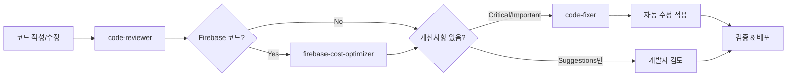
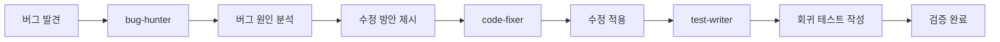
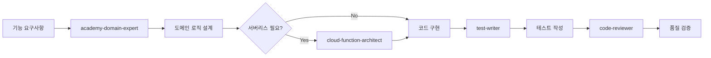
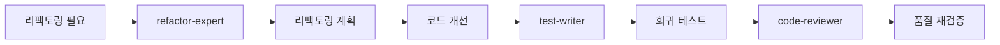
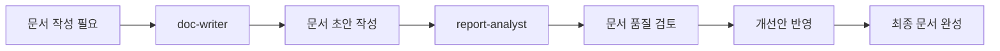

# 🔄 에이전트 협업 워크플로우

> **작성일**: 2026-01-08
> **목적**: Claude Code 에이전트 간 효율적인 협업 프로세스 정의

---

## 📋 목차

1. [핵심 워크플로우](#핵심-워크플로우)
2. [워크플로우별 상세 가이드](#워크플로우별-상세-가이드)
3. [에이전트 역할 매트릭스](#에이전트-역할-매트릭스)
4. [트리거 조건](#트리거-조건)
5. [사용 시나리오](#사용-시나리오)

---

## 🎯 핵심 워크플로우

### 1️⃣ 코드 품질 관리 파이프라인 (필수)



**실행 명령어 순서**:
```bash
1. code-reviewer 에이전트 실행 (코드 품질 검토)
2. firebase-cost-optimizer 에이전트 실행 (Firebase 코드 발견 시)
3. code-fixer 에이전트 실행 (자동 수정 적용)
```

**트리거 키워드**:
- "코드 점검", "코드 리뷰", "검토해줘", "체크해줘"

---

### 2️⃣ 버그 수정 워크플로우



**실행 명령어 순서**:
```bash
1. bug-hunter 에이전트 실행 (버그 분석)
2. code-fixer 에이전트 실행 (수정 적용)
3. test-writer 에이전트 실행 (테스트 추가)
```

**트리거 키워드**:
- "버그", "에러", "오류", "bug", "error", "문제 발생"

---

### 3️⃣ 기능 개발 워크플로우



**실행 명령어 순서**:
```bash
1. academy-domain-expert 에이전트 실행 (도메인 설계)
2. cloud-function-architect 에이전트 실행 (필요 시)
3. [코드 작성]
4. test-writer 에이전트 실행 (테스트)
5. code-reviewer 에이전트 실행 (품질 검증)
```

**트리거 키워드**:
- "기능 추가", "새로운 기능", "구현해줘", "만들어줘"

---

### 4️⃣ 리팩토링 워크플로우



**실행 명령어 순서**:
```bash
1. refactor-expert 에이전트 실행 (리팩토링 설계)
2. code-fixer 에이전트 실행 (코드 수정)
3. test-writer 에이전트 실행 (회귀 테스트)
4. code-reviewer 에이전트 실행 (검증)
```

**트리거 키워드**:
- "리팩토링", "코드 개선", "최적화", "구조 개선"

---

### 5️⃣ 문서화 워크플로우



**실행 명령어 순서**:
```bash
1. doc-writer 에이전트 실행 (문서 작성)
2. report-analyst 에이전트 실행 (품질 검토)
3. doc-writer 에이전트 실행 (개선 반영)
```

**트리거 키워드**:
- "문서 작성", "README", "API 문서", "가이드"

---

## 📊 워크플로우별 상세 가이드

### 워크플로우 1: 코드 품질 관리 (가장 자주 사용)

#### 📍 언제 사용?
- 새로운 코드 작성 후
- 기존 코드 수정 후
- PR 제출 전
- 정기적인 코드 점검 시

#### 🎯 목표
- 코드 품질 향상
- Firebase 비용 최적화
- 베스트 프랙티스 적용
- 자동화된 개선

#### 📝 실행 예시

**Step 1: code-reviewer 실행**
```
사용자: "src/components/StudentList.tsx 파일 코드 리뷰해줘"
→ code-reviewer 자동 실행
→ 품질 검토 리포트 생성
```

**Step 2: firebase-cost-optimizer 실행 (조건부)**
```
code-reviewer가 Firestore 쿼리 발견 시 자동 호출
→ 비용 분석 리포트 생성
→ 최적화 권장사항 제시
```

**Step 3: code-fixer 실행**
```
사용자: "리뷰 피드백 반영해서 수정해줘"
→ code-fixer 자동 실행
→ Critical/Important 이슈 자동 수정
→ 검증 및 리포트 생성
```

#### ✅ 완료 기준
- [ ] ESLint 에러 0개
- [ ] TypeScript 에러 0개
- [ ] Firebase 비용 최적화 완료
- [ ] 모든 Critical 이슈 해결
- [ ] 테스트 통과

---

### 워크플로우 2: 버그 수정

#### 📍 언제 사용?
- 버그 리포트 접수 시
- 에러 로그 발견 시
- 사용자 불만 접수 시
- QA 테스트 실패 시

#### 🎯 목표
- 버그 근본 원인 파악
- 안전한 수정 적용
- 재발 방지 테스트 추가

#### 📝 실행 예시

**Step 1: bug-hunter 실행**
```
사용자: "출석 체크 시 에러 발생하는데 원인 찾아줘"
→ bug-hunter 실행
→ 에러 메시지 분석
→ 스택 트레이스 추적
→ 근본 원인 식별
→ 수정 방안 제시
```

**Step 2: code-fixer 실행**
```
사용자: "버그 수정해줘"
→ bug-hunter의 수정 방안 적용
→ 관련 코드 수정
→ 검증
```

**Step 3: test-writer 실행**
```
사용자: "이 버그에 대한 회귀 테스트 작성해줘"
→ test-writer 실행
→ 버그 재현 테스트 작성
→ 수정 후 테스트 통과 확인
```

#### ✅ 완료 기준
- [ ] 버그 근본 원인 파악
- [ ] 수정 완료 및 검증
- [ ] 회귀 테스트 추가
- [ ] 관련 문서 업데이트

---

### 워크플로우 3: 기능 개발

#### 📍 언제 사용?
- 새로운 기능 추가 시
- 기존 기능 확장 시
- 학원 관리 시스템 기능 설계 시

#### 🎯 목표
- 도메인 로직 정확성
- 확장 가능한 아키텍처
- 안정적인 서버리스 구현
- 포괄적인 테스트

#### 📝 실행 예시

**Step 1: academy-domain-expert 실행**
```
사용자: "학생 출석률 자동 계산 기능 설계해줘"
→ academy-domain-expert 실행
→ 도메인 모델 설계
→ 비즈니스 로직 제시
→ 데이터 구조 권장
```

**Step 2: cloud-function-architect 실행 (필요 시)**
```
사용자: "이 기능을 Cloud Function으로 구현하려면?"
→ cloud-function-architect 실행
→ 트리거 설계
→ 멱등성 보장 방안
→ 비용 최적화 전략
```

**Step 3: 코드 구현**
```
[개발자가 직접 코드 작성 또는 AI 지원 코딩]
```

**Step 4: test-writer 실행**
```
사용자: "작성한 코드에 대한 테스트 작성해줘"
→ test-writer 실행
→ 단위 테스트 작성
→ 통합 테스트 작성
→ Edge case 커버
```

**Step 5: code-reviewer 실행**
```
사용자: "전체 코드 점검해줘"
→ 워크플로우 1 실행 (코드 품질 관리)
```

#### ✅ 완료 기준
- [ ] 도메인 로직 정확성 검증
- [ ] 코드 구현 완료
- [ ] 테스트 커버리지 80% 이상
- [ ] 코드 리뷰 통과
- [ ] Firebase 비용 최적화

---

### 워크플로우 4: 리팩토링

#### 📍 언제 사용?
- 코드 복잡도가 높아질 때
- 기술 부채 해소 시
- 성능 개선 필요 시
- 코드 중복 제거 시

#### 🎯 목표
- 코드 가독성 향상
- 유지보수성 개선
- 성능 최적화
- 기능 보존 (중요!)

#### 📝 실행 예시

**Step 1: refactor-expert 실행**
```
사용자: "StudentList 컴포넌트 리팩토링 계획 세워줘"
→ refactor-expert 실행
→ 현재 코드 분석
→ 개선 포인트 식별
→ 리팩토링 계획 제시
→ 우선순위 정렬
```

**Step 2: code-fixer 실행**
```
사용자: "리팩토링 계획 실행해줘"
→ 단계별 코드 수정
→ 기능 보존 확인
→ 성능 측정
```

**Step 3: test-writer 실행**
```
사용자: "리팩토링 후 회귀 테스트 강화해줘"
→ 기존 테스트 검증
→ 추가 테스트 작성
→ Edge case 보강
```

**Step 4: code-reviewer 실행**
```
사용자: "리팩토링 결과 검증해줘"
→ 코드 품질 재검증
→ 성능 개선 확인
→ 베스트 프랙티스 준수 확인
```

#### ✅ 완료 기준
- [ ] 기능 100% 보존
- [ ] 코드 복잡도 감소
- [ ] 성능 개선 (또는 동일)
- [ ] 모든 테스트 통과
- [ ] 문서 업데이트

---

### 워크플로우 5: 문서화

#### 📍 언제 사용?
- 새로운 기능 완성 후
- API 변경 시
- README 작성/업데이트 시
- 보고서 작성 시

#### 🎯 목표
- 명확한 문서 작성
- 높은 가독성
- 완전한 정보 제공
- 지속적인 품질 유지

#### 📝 실행 예시

**Step 1: doc-writer 실행**
```
사용자: "출석 관리 API 문서 작성해줘"
→ doc-writer 실행
→ API 엔드포인트 문서화
→ 요청/응답 예시 작성
→ 에러 코드 설명
```

**Step 2: report-analyst 실행**
```
사용자: "작성한 문서 검토해줘"
→ report-analyst 실행
→ 구조 분석
→ 내용 완결성 검증
→ 가독성 평가
→ 개선안 제시
```

**Step 3: doc-writer 실행 (개선)**
```
사용자: "피드백 반영해서 수정해줘"
→ 개선안 적용
→ 최종 문서 완성
```

#### ✅ 완료 기준
- [ ] 모든 필수 정보 포함
- [ ] 예시 코드 작동 확인
- [ ] 가독성 검증 완료
- [ ] 오타/문법 오류 0개
- [ ] 링크 유효성 확인

---

## 🗂️ 에이전트 역할 매트릭스

### 전체 에이전트 목록과 역할

| 에이전트 | 주요 역할 | 입력 | 출력 | 다음 단계 |
|---------|----------|------|------|----------|
| **academy-domain-expert** | 학원 도메인 설계 | 기능 요구사항 | 도메인 모델, 비즈니스 로직 | cloud-function-architect / 코드 구현 |
| **bug-hunter** | 버그 분석 | 에러 메시지, 증상 | 원인 분석, 수정 방안 | code-fixer |
| **cloud-function-architect** | 서버리스 설계 | 기능 요구사항 | Cloud Function 설계 | 코드 구현 |
| **code-fixer** | 자동 수정 | 리뷰 피드백 | 수정된 코드 | 검증 |
| **code-reviewer** | 코드 품질 검토 | 소스 코드 | 리뷰 리포트 | firebase-cost-optimizer / code-fixer |
| **doc-writer** | 문서 작성 | 코드, 기능 설명 | README, API 문서 | report-analyst |
| **firebase-cost-optimizer** | 비용 최적화 | Firestore 쿼리 | 비용 분석, 최적화 권장 | code-fixer |
| **refactor-expert** | 리팩토링 | 기존 코드 | 리팩토링 계획 | code-fixer |
| **report-analyst** | 문서 검토 | 마크다운 문서 | 개선안 | doc-writer |
| **test-writer** | 테스트 작성 | 소스 코드 | 테스트 코드 | code-reviewer |

---

### 협업 관계 매트릭스

| From ↓ / To → | academy | bug | cloud | fixer | reviewer | doc | firebase | refactor | report | test |
|--------------|---------|-----|-------|-------|----------|-----|----------|----------|--------|------|
| **academy-domain-expert** | - | | ✅ | | | ✅ | | | | |
| **bug-hunter** | | - | | ✅ | | | | | | ✅ |
| **cloud-function-architect** | | | - | ✅ | | ✅ | | | | |
| **code-fixer** | | | | - | ✅ | | | | | |
| **code-reviewer** | | | | ✅ | - | | ✅ | | | |
| **doc-writer** | | | | | | - | | | ✅ | |
| **firebase-cost-optimizer** | | | | ✅ | | | - | | | |
| **refactor-expert** | | | | ✅ | | | | - | | ✅ |
| **report-analyst** | | | | | | ✅ | | | - | |
| **test-writer** | | | | | ✅ | | | | | - |

✅ = 직접 협업 관계

---

## 🔔 트리거 조건

### 자동 트리거가 설정된 에이전트

| 에이전트 | 트리거 유형 | 트리거 조건 |
|---------|-----------|-----------|
| **code-reviewer** | `trigger_on_code_review: true` | "코드 점검", "코드 리뷰", "검토", "체크" |
| **firebase-cost-optimizer** | `trigger_on_firebase_code: true` | Firestore 코드 발견 시 |
| **code-fixer** | `trigger_after_code_review: true` | code-reviewer가 Critical/Important 이슈 발견 시 |
| **cloud-function-architect** | `trigger_on_phrases` | "Cloud Function", "클라우드 펑션", "서버리스", "트리거" |

### 추가 권장 트리거 (업데이트 예정)

| 에이전트 | 권장 트리거 |
|---------|----------|
| **bug-hunter** | "버그", "에러", "오류", "bug", "error", "문제 발생" |
| **test-writer** | refactor-expert 실행 후, 새 기능 구현 후 |
| **doc-writer** | 새 기능 완성 후, API 변경 시 |
| **refactor-expert** | 복잡도 임계값 초과 시 |
| **report-analyst** | .md 파일 업로드 시 |

---

## 💡 사용 시나리오

### 시나리오 1: 출석 관리 기능 추가

```
[상황] 학생 출석을 자동으로 집계하는 기능 추가 필요

Step 1: "학생 출석 자동 집계 기능 설계해줘"
→ academy-domain-expert 실행
→ 도메인 모델 제시

Step 2: "이 기능을 Cloud Function으로 구현하려면?"
→ cloud-function-architect 실행
→ onCreate 트리거 설계 제시

Step 3: [코드 구현]

Step 4: "구현한 코드 테스트 작성해줘"
→ test-writer 실행
→ 단위/통합 테스트 생성

Step 5: "전체 코드 점검해줘"
→ code-reviewer 실행
→ firebase-cost-optimizer 자동 실행
→ code-fixer 실행 (필요 시)

Step 6: "API 문서 작성해줘"
→ doc-writer 실행
→ report-analyst 실행 (검토)
```

---

### 시나리오 2: 성능 저하 문제 해결

```
[상황] 학생 목록 로딩이 느려짐

Step 1: "학생 목록 로딩 느린 문제 분석해줘"
→ bug-hunter 실행
→ 원인: 전체 컬렉션 조회 + 페이지네이션 없음

Step 2: "Firebase 비용도 같이 확인해줘"
→ firebase-cost-optimizer 실행
→ 비용 핫스팟 발견

Step 3: "최적화 방안 적용해줘"
→ code-fixer 실행
→ 페이지네이션 추가
→ React Query 캐싱 적용

Step 4: "최적화 후 테스트 작성해줘"
→ test-writer 실행

Step 5: "최종 검증"
→ code-reviewer 실행
```

---

### 시나리오 3: 레거시 코드 리팩토링

```
[상황] App.tsx가 2000줄로 비대해짐

Step 1: "App.tsx 리팩토링 계획 세워줘"
→ refactor-expert 실행
→ 컴포넌트 분리 계획 제시

Step 2: "계획대로 리팩토링 실행해줘"
→ code-fixer 실행
→ 컴포넌트 분리
→ 커스텀 훅 추출

Step 3: "리팩토링 후 회귀 테스트 강화"
→ test-writer 실행

Step 4: "리팩토링 결과 검증"
→ code-reviewer 실행

Step 5: "변경 사항 문서화"
→ doc-writer 실행
```

---

### 시나리오 4: 긴급 버그 수정

```
[상황] 프로덕션에서 출석 체크 시 에러 발생

Step 1: "출석 체크 에러 원인 찾아줘"
→ bug-hunter 실행
→ null 참조 에러 발견

Step 2: "버그 즉시 수정해줘"
→ code-fixer 실행
→ null 체크 추가

Step 3: "회귀 테스트 추가"
→ test-writer 실행

Step 4: "핫픽스 코드 최종 검증"
→ code-reviewer 실행 (빠른 검토)

Step 5: [배포]
```

---

### 시나리오 5: 월간 보고서 작성

```
[상황] 월간 개발 현황 보고서 작성 필요

Step 1: "12월 개발 현황 보고서 초안 작성"
→ doc-writer 실행
→ 기본 구조 작성

Step 2: "보고서 품질 검토"
→ report-analyst 실행
→ 구조, 내용, 가독성 평가
→ 개선안 제시

Step 3: "피드백 반영해서 수정"
→ doc-writer 실행

Step 4: "최종 검토"
→ report-analyst 실행
```

---

## 📈 효율성 극대화 팁

### 1. 병렬 실행 활용
```
# 동시에 여러 에이전트 실행 가능한 경우
사용자: "StudentList.tsx 코드 리뷰하고 테스트도 작성해줘"
→ code-reviewer + test-writer 병렬 실행
```

### 2. 체인 실행
```
# 순차 실행이 필요한 경우
사용자: "코드 리뷰 → 비용 최적화 → 자동 수정까지 한 번에"
→ code-reviewer → firebase-cost-optimizer → code-fixer 순차 실행
```

### 3. 조건부 실행
```
# 결과에 따라 다음 단계 결정
code-reviewer 결과에 Critical 이슈가 없으면 code-fixer 생략
```

### 4. 컨텍스트 공유
```
# 이전 에이전트 결과를 다음 에이전트에 전달
bug-hunter가 발견한 원인을 code-fixer가 참조
```

---

## ⚠️ 주의사항

### 워크플로우 실행 시 주의할 점

1. **순서 준수**
   - 의존 관계가 있는 에이전트는 순서대로 실행
   - 예: code-reviewer → code-fixer (역순 불가)

2. **중복 실행 방지**
   - 같은 에이전트를 짧은 시간에 반복 실행하지 않기
   - 이전 결과를 먼저 검토 후 다음 단계 진행

3. **컨텍스트 유지**
   - 한 워크플로우 내에서는 동일한 파일/기능에 집중
   - 여러 기능을 동시에 처리하면 혼란 발생 가능

4. **검증 단계 필수**
   - 자동 수정 후 반드시 동작 확인
   - 테스트 실행으로 기능 보존 검증

5. **문서화 습관**
   - 중요한 변경사항은 문서에 기록
   - 워크플로우 실행 로그 보관

---

## 🔄 워크플로우 업데이트

### 버전 관리
- **v1.0** (2026-01-08): 초기 워크플로우 정의
- **v1.1** (예정): 자동 트리거 조건 추가
- **v1.2** (예정): 중복 기능 정리 완료

### 피드백
워크플로우 개선 제안은 팀 회의 또는 이슈 트래커에 등록

---

## 📚 참고 자료

- [에이전트 개별 문서](.claude/agents/)
- [Claude Code 공식 문서](https://claude.com/claude-code)
- [베스트 프랙티스 가이드](링크 추가 예정)

---

**문서 작성**: Claude Sonnet 4.5
**최종 검토**: 2026-01-08
