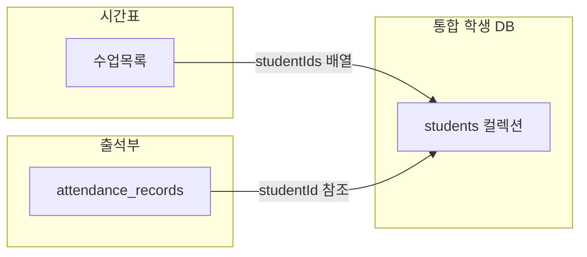

# 통합 학생 DB 구현 계획서

## 1. 현재 시스템 분석

### 📊 Firebase 컬렉션 현황

| 컬렉션 | 용도 | 학생 저장 방식 |
|--------|------|---------------|
| `수업목록` | 영어/수학 시간표 | `studentList` 배열 (임베딩) |
| `수업목록_draft` | 시뮬레이션 모드 | 상동 |
| `attendance_students` | 출석부 학생 | 별도 문서 |
| `attendance_records` | 출석 기록 | 월별 분리 저장 |

### 🔍 문제점

1. **데이터 중복**: 같은 학생이 시간표와 출석부에 별도 존재
2. **동기화 불가**: 한쪽 수정 시 다른 쪽 미반영
3. **중복 저장**: 여러 수업에 같은 학생 → 수업마다 중복

---

## 2. 통합 스키마 설계

### 🆕 새 컬렉션: `students`

```typescript
interface UnifiedStudent {
  // 기본 정보
  id: string;                    // UUID
  name: string;                  // 이름
  englishName?: string;          // 영어 이름
  school?: string;               // 학교
  grade?: string;                // 학년
  
  // 과목 및 담당
  subject: 'math' | 'english';   // 과목
  teacherIds: string[];          // 담당 강사 ID 배열
  
  // 상태 관리
  status: 'active' | 'on_hold' | 'withdrawn';
  startDate: string;             // 등록일 (YYYY-MM-DD)
  endDate?: string;              // 퇴원일
  
  // 출석부 연동
  salarySettingId?: string;      // 급여 설정
  days?: string[];               // 수업 요일
  group?: string;                // 반 이름
  
  // 메타데이터
  createdAt: string;
  updatedAt: string;
}
```

### 📐 참조 구조



---

## 3. 마이그레이션 전략

### Phase 1: 기반 작업 (1일)

#### 변경 파일
- [types.ts](file:///d:/ijw-calander/types.ts) - `UnifiedStudent` 타입 추가
- [firestore.rules](file:///d:/ijw-calander/firestore.rules) - `students` 규칙 추가
- `hooks/useStudents.ts` **[NEW]** - 통합 학생 CRUD 훅

#### 작업 내용
1. `UnifiedStudent` 타입 정의
2. Firestore Security Rules 업데이트
3. 새 훅 `useStudents` 생성

---

### Phase 2: 마이그레이션 스크립트 (1일)

#### 작업 내용
1. `수업목록`의 모든 `studentList` 추출
2. 중복 학생 감지 (이름+학교+학년 기준)
3. `students` 컬렉션에 저장
4. 원본 데이터 백업 생성

```typescript
// scripts/migrateStudents.ts (신규 생성)
async function migrateStudentsFromTimetable() {
  // 1. 기존 데이터 백업
  // 2. 모든 수업의 studentList 수집
  // 3. 중복 제거 및 병합
  // 4. students 컬렉션에 저장
  // 5. 각 수업에 studentIds 업데이트
}
```

---

### Phase 3: 시간표 수정 (2-3일)

#### 변경 파일
- [types.ts](file:///d:/ijw-calander/types.ts) - `TimetableClass.studentIds` 추가
- [useStudentDragDrop.ts](file:///d:/ijw-calander/components/Timetable/Math/hooks/useStudentDragDrop.ts)
- [englishUtils.ts](file:///d:/ijw-calander/components/Timetable/English/englishUtils.ts)
- 영어/수학 시간표 컴포넌트들

#### 작업 내용
1. `TimetableClass` 타입 수정
   ```diff
   interface TimetableClass {
   -  studentList: TimetableStudent[];
   +  studentList?: TimetableStudent[];  // 하위 호환성
   +  studentIds?: string[];              // 신규
   }
   ```
2. 학생 표시 로직 수정 (students 컬렉션에서 조회)
3. 학생 추가/삭제 로직 수정

---

### Phase 4: 출석부 수정 (1-2일)

#### 변경 파일
- [useAttendance.ts](file:///d:/ijw-calander/hooks/useAttendance.ts)
- [AttendanceManager.tsx](file:///d:/ijw-calander/components/Attendance/AttendanceManager.tsx)
- 출석부 컴포넌트들

#### 작업 내용
1. `useAttendanceStudents` → `useStudents` 사용
2. `attendance_students` 컬렉션 참조 제거
3. `attendance_records`는 기존 구조 유지

---

### Phase 5: 검증 및 정리 (1일)

#### 작업 내용
1. 통합 테스트
2. 성능 검증
3. 문서 업데이트
4. (선택) 구 데이터 아카이브

---

## 4. 리스크 분석 및 롤백 계획

| 리스크 | 원인 | 완화 전략 | 롤백 방법 |
|--------|------|----------|----------|
| 🔴 데이터 손실 | 마이그레이션 에러 | 백업 필수, 트랜잭션 사용 | 백업에서 복원 |
| 🟠 중복 학생 | 같은 학생 여러 수업 | 이름+학교+학년 중복 감지 | 수동 검토 |
| 🟠 서비스 중단 | 코드 충돌 | 점진적 마이그레이션 | Git revert |
| 🟡 성능 저하 | 추가 쿼리 | 캐싱, 배치 조회 | 튜닝 |

### 롤백 시나리오

```
Phase 3/4 실패 시:
1. Git revert로 코드 원복
2. 기존 컬렉션 그대로 사용
3. students 컬렉션 삭제 (선택)
```

---

## 5. 일정 요약

| Phase | 작업 | 예상 기간 | 의존성 |
|:-----:|------|:--------:|--------|
| 1 | 기반 작업 | 1일 | - |
| 2 | 마이그레이션 | 1일 | Phase 1 |
| 3 | 시간표 수정 | 2-3일 | Phase 2 |
| 4 | 출석부 수정 | 1-2일 | Phase 2 |
| 5 | 검증/정리 | 1일 | Phase 3, 4 |

**총 예상 기간: 6-8일**

---

## User Review Required

> [!WARNING]
> **중요 결정 사항:**
> 1. 이 계획을 승인하고 Phase 1부터 진행할까요?
> 2. 수정이 필요한 부분이 있으신가요?
> 3. 일정에 대한 의견이 있으신가요?
