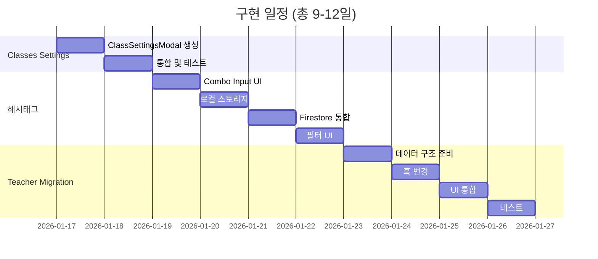

# 종합 구현 계획서 (2026-01-16)

**작성일**: 2026-01-16
**작성자**: AI Assistant
**상태**: 최종 검토 대기

---

## 📋 목차

1. [프로젝트 개요](#프로젝트-개요)
2. [Teacher → Staff 마이그레이션](#teacher--staff-마이그레이션)
3. [Classes Settings 통합](#classes-settings-통합)
4. [연간 일정 해시태그 개선](#연간-일정-해시태그-개선)
5. [통합 일정 및 우선순위](#통합-일정-및-우선순위)
6. [리스크 관리](#리스크-관리)

---

## 프로젝트 개요

### 진행 중인 3개 주요 프로젝트

| 프로젝트 | 규모 | 예상 기간 | 위험도 | 우선순위 |
|---------|------|-----------|--------|----------|
| Teacher → Staff 통합 | 대 (30+ 파일) | 4일 | 중 | 높음 |
| Classes Settings 통합 | 소 (3-4 파일) | 2일 | 낮음 | 중 |
| 해시태그 개선 | 중 (5-7 파일) | 3-6일 | 낮음 | 중 |

---

## Teacher → Staff 마이그레이션

### 목표
기존 `teachers` 컬렉션을 `staff` 컬렉션으로 통합하여 강사와 직원을 통합 관리

### 현황 분석

#### 영향받는 파일 (30+ 개)
```
📁 types.ts (Teacher 인터페이스)
📁 hooks/useFirebaseQueries.ts (useTeachers 훅)
📁 App.tsx (전역 teachers 상태)

📂 설정 관련 (3개)
├── Settings/TeachersTab.tsx
├── Settings/SettingsModal.tsx
└── Settings/modals/UserDetailModal.tsx

📂 수업 관리 (3개)
├── ClassManagement/AddClassModal.tsx
├── ClassManagement/EditClassModal.tsx
└── ClassManagement/ClassDetailModal.tsx

📂 수학 시간표 (4개)
├── Timetable/Math/hooks/useTimetableClasses.ts
├── Timetable/Math/components/TimetableGrid.tsx
├── Timetable/Math/components/ClassCard.tsx
└── Timetable/TimetableManager.tsx

📂 영어 시간표 (9개)
├── Timetable/English/EnglishTimetable.tsx
├── Timetable/English/EnglishTeacherTab.tsx
├── Timetable/English/EnglishClassTab.tsx
├── Timetable/English/EnglishRoomTab.tsx
├── Timetable/English/ClassCard.tsx
├── Timetable/English/IntegrationViewSettings.tsx
├── Timetable/English/MiniGridRow.tsx
├── Timetable/English/TeacherOrderModal.tsx
└── Timetable/English/hooks/useEnglishClasses.ts

📂 출석부 (2개)
├── Attendance/AttendanceManager.tsx
└── Attendance/components/SalarySettingsTab.tsx

📂 학생 관리 (1개)
└── StudentManagement/tabs/CoursesTab.tsx

📂 기타
├── Timetable/English/englishUtils.ts (getTeacherColor)
└── scripts/migrateStudents.ts
```

### 구현 단계

#### Phase 1: 데이터 구조 준비 (Day 1)

**1.1 StaffMember 인터페이스 확장**
```typescript
// types.ts 수정
export interface StaffMember {
  // 기존 필드
  id: string;
  userId?: string;
  name: string;
  email: string;
  phone?: string;
  role: 'teacher' | 'admin' | 'staff';
  subjects?: ('math' | 'english')[];
  hireDate: string;
  status: 'active' | 'inactive' | 'resigned';
  workSchedule?: WeeklySchedule;
  profileImage?: string;
  memo?: string;
  createdAt: string;
  updatedAt: string;

  // === 선생님 전용 필드 추가 ===
  isHiddenInTimetable?: boolean;  // 시간표에서 숨김
  isNative?: boolean;             // 원어민 강사 여부
  bgColor?: string;               // 배경색
  textColor?: string;             // 글자색
  defaultRoom?: string;           // 기본 강의실
  timetableOrder?: number;        // 시간표 정렬 순서
}
```

**1.2 마이그레이션 스크립트 작성**
- [ ] `scripts/migrate-teachers-to-staff.ts` 생성
- [ ] teachers → staff 데이터 복사 로직
- [ ] 필드 매핑:
  - `isHidden` → `isHiddenInTimetable`
  - `order` → `timetableOrder`
  - `color` 제거 (미사용)
- [ ] 중복 체크 (이름 기준)
- [ ] 롤백 기능

#### Phase 2: 훅 및 API 변경 (Day 2)

**2.1 useStaff 훅 확장**
```typescript
// hooks/useStaff.ts 수정
export function useStaffTeachers() {
  const { staff, loading, error } = useStaff();

  const teachers = useMemo(() =>
    staff.filter(s => s.role === 'teacher' && s.status === 'active')
      .sort((a, b) => (a.timetableOrder || 0) - (b.timetableOrder || 0)),
    [staff]
  );

  return { teachers, loading, error };
}
```

**2.2 기존 참조 업데이트 (7개 위치)**
- [ ] App.tsx - `useTeachers()` → `useStaffTeachers()`
- [ ] AddClassModal.tsx
- [ ] EditClassModal.tsx
- [ ] ClassDetailModal.tsx
- [ ] useTimetableClasses.ts
- [ ] CoursesTab.tsx
- [ ] (필요시) 기타 컴포넌트

#### Phase 3: UI 통합 (Day 3)

**3.1 StaffManager 확장**
- [ ] role='teacher' 선택 시 추가 필드 표시
  - 시간표 표시 토글
  - 원어민 여부 체크박스
  - 색상 선택기 (배경/텍스트)
  - 기본 강의실 입력
  - 시간표 정렬 순서

**3.2 강사 관리 탭 제거**
- [ ] Settings/SettingsModal.tsx 수정
- [ ] TeachersTab 제거 또는 리다이렉트 메시지
- [ ] "직원 관리 탭에서 관리하세요" 안내

#### Phase 4: 정리 및 테스트 (Day 4)

**4.1 레거시 정리**
- [ ] `useTeachers` 훅 deprecated 마킹
- [ ] `teachers` 컬렉션 유지 (30일간)
- [ ] 관련 주석 업데이트

**4.2 통합 테스트**
- [ ] 시간표에 강사 표시 확인
- [ ] 수업 추가/수정 시 강사 선택
- [ ] 출석부 강사 필터
- [ ] 강사 색상 시간표 적용
- [ ] 강사 정렬 순서 동작

---

## Classes Settings 통합

### 목표
Settings/ClassesTab의 설정 기능을 ClassManagementTab으로 이동

### 영향받는 컴포넌트

```
📂 신규 생성
└── ClassManagement/ClassSettingsModal.tsx

📂 수정
├── ClassManagement/ClassManagementTab.tsx (설정 버튼 추가)
└── Settings/SettingsModal.tsx (탭 제거)

📂 Deprecated
└── Settings/ClassesTab.tsx
```

### UI 설계

#### ClassManagementTab 헤더
```
┌─────────────────────────────────────────────────────────┐
│ 수업 관리                                    [⚙️ 설정]  │
├─────────────────────────────────────────────────────────┤
│ [전체] [수학] [영어] | [강사▼] | [월화수목금토일] | 검색 │
└─────────────────────────────────────────────────────────┘
```

#### ClassSettingsModal
```
┌─────────────────────────────────────────────────────────┐
│              수업 설정                           [X]    │
├─────────────────────────────────────────────────────────┤
│ 📅 스케줄 표기 방식                                     │
│   수학: ⚪ 교시 ⚫ 시간대                               │
│   영어: ⚫ 교시 ⚪ 시간대                               │
├─────────────────────────────────────────────────────────┤
│ 🎨 수업 키워드 색상                                     │
│   [Phonics 🔵] [Grammar 🟢] [Reading 🟡] [+추가]      │
└─────────────────────────────────────────────────────────┘
```

### 구현 단계 (2일)

#### Day 1
- [ ] ClassSettingsModal.tsx 생성
- [ ] ClassesTab 로직 리팩토링
- [ ] ClassManagementTab에 설정 버튼 추가
- [ ] 모달 상태 관리 연결

#### Day 2
- [ ] SettingsModal에서 Classes 탭 제거
- [ ] ClassesTab deprecated 마킹
- [ ] 테스트:
  - 스케줄 표기 변경
  - 키워드 색상 CRUD
  - 시간표 반영 확인

### 보완 필요 사항

#### 확인 필요 (9개 항목)
1. **훅 의존성**: useScheduleDisplay, useClassKeywords 존재 여부
2. **모달 중첩**: ClassManagementTab이 이미 모달 안에 있는지
3. **권한 체크**: 설정 접근 권한 확인
4. **상태 관리**: 취소 시 롤백 로직
5. **반응형 디자인**: 모바일 대응
6. **사용자 마이그레이션**: 안내 메시지 기간
7. **테스트 전략**: 기존 테스트 코드
8. **다국어 지원**: 버튼 라벨 번역
9. **대안 평가**: 왜 옵션 A를 선택했는지

---

## 연간 일정 해시태그 개선

### 목표
기본 해시태그를 유지하면서 사용자 정의 해시태그 추가 가능

### 현재 구조
```typescript
// 고정된 6개 태그
const DEFAULT_TAGS = ['회의', '세미나', '시험', '휴일', '마감', '행사'];

interface CalendarEvent {
  hashtags: string[]; // 선택된 태그들
}
```

### 개선 설계

#### UI 옵션 1: Combo Input (권장)

**입력 영역**
```
┌─────────────────────────────────────┐
│ 해시태그 추가                        │
│ ┌─────────────────────────────────┐ │
│ │ # 입력 또는 선택... ▼           │ │ ← Combobox
│ └─────────────────────────────────┘ │
│                                      │
│ 선택된 태그:                         │
│ [# 회의 ×] [# 학부모상담 ×]         │
└─────────────────────────────────────┘
```

**드롭다운**
```
┌──────────────────────┐
│ 기본 태그            │
│ ✓ # 회의            │
│   # 세미나          │
│   # 시험            │
│ ──────────────────── │
│ 최근 사용           │
│   # 학부모상담      │
│   # 내부회의        │
│ ──────────────────── │
│ "상담" 직접 추가?   │ ← 새 태그 생성
└──────────────────────┘
```

**필터 UI 개선**
```
┌──────────────────────────────────────┐
│ # 해시태그                         ▼ │
├──────────────────────────────────────┤
│ 🔍 태그 검색...                      │
├──────────────────────────────────────┤
│ 자주 사용                            │
│ ☑ # 회의 (24)                       │
│ ☐ # 세미나 (8)                      │
│ ☑ # 시험 (12)                       │
│                                      │
│ 기타                                 │
│ ☐ # 학부모상담 (5)                  │
│ ☐ # 내부회의 (3)                    │
│                                      │
│ [전체 선택] [선택 해제]              │
└──────────────────────────────────────┘
```

### 데이터 구조

```typescript
// 기존 CalendarEvent는 변경 없음
interface CalendarEvent {
  id: string;
  title: string;
  hashtags: string[]; // ['회의', '학부모상담', '내부회의']
  // ... 기타 필드
}

// 새로운 컬렉션 또는 로컬 스토리지
interface HashtagUsage {
  tag: string;
  count: number;
  lastUsed: Date;
  isCustom: boolean; // true면 커스텀, false면 기본
}

// 상수
const DEFAULT_HASHTAGS = ['회의', '세미나', '시험', '휴일', '마감', '행사'];
```

### 구현 계획

#### Phase 1: 기본 기능 (1-2일)

**Day 1: Combo Input UI**
- [ ] Combobox 컴포넌트 생성
  - 자동완성 기능
  - 키보드 네비게이션
  - 엔터로 태그 추가
- [ ] 태그 칩 컴포넌트
  - × 버튼으로 제거
  - 중복 방지
- [ ] 기본 6개 태그 표시

**Day 2: 로컬 스토리지 저장**
- [ ] 최근 사용 태그 저장 (localStorage)
- [ ] 사용 횟수 카운트
- [ ] 최대 20개 저장

#### Phase 2: 고도화 (3-4일)

**Day 3: Firestore 통합**
- [ ] `hashtagUsage` 컬렉션 생성
- [ ] 사용자별 커스텀 태그 저장
- [ ] 사용 빈도 집계

**Day 4: 필터 UI 개선**
- [ ] 검색 기능 추가
- [ ] 사용 횟수 표시
- [ ] 그룹화 (자주 사용 / 기타)
- [ ] 전체 선택/해제 버튼

**Day 5-6: 태그 관리 UI**
- [ ] 설정에 태그 관리 섹션 추가
- [ ] 커스텀 태그 편집/삭제
- [ ] 태그 병합 기능 (중복 제거)

#### Phase 3: 선택적 기능

- [ ] 태그 카테고리화
- [ ] 태그 색상 커스터마이징
- [ ] 전체 사용자에게 태그 공유
- [ ] 태그 제안 시스템

### 검증 로직

```typescript
// 태그 유효성 검사
function validateHashtag(tag: string): boolean {
  // # 제거
  const cleanTag = tag.replace(/^#/, '').trim();

  // 검증 규칙
  if (cleanTag.length === 0) return false;
  if (cleanTag.length > 15) return false;
  if (!/^[가-힣a-zA-Z0-9\s]+$/.test(cleanTag)) return false;

  return true;
}

// 중복 방지
function addHashtag(existing: string[], newTag: string): string[] {
  const cleaned = newTag.replace(/^#/, '').trim();
  if (existing.includes(cleaned)) return existing;
  return [...existing, cleaned];
}
```

---

## 통합 일정 및 우선순위

### 권장 실행 순서



### 우선순위 이유

1. **Classes Settings (1-2일)** - 낮은 위험, 빠른 완료
2. **해시태그 개선 (3-6일)** - 독립적, 사용자 가치 높음
3. **Teacher Migration (4일)** - 복잡도 높음, 충분한 테스트 필요

---

## 리스크 관리

### Teacher → Staff 마이그레이션

| 리스크 | 영향도 | 완화 방안 |
|--------|--------|-----------|
| 데이터 불일치 | 높음 | 마이그레이션 전 검수, 롤백 스크립트 |
| 참조 누락 | 중간 | 전역 검색, 단계별 교체, 충분한 테스트 |
| 성능 저하 | 낮음 | 인덱스 확인, 쿼리 최적화 |

**롤백 계획**: teachers 컬렉션 30일간 유지, 언제든 되돌리기 가능

### Classes Settings 통합

| 리스크 | 영향도 | 완화 방안 |
|--------|--------|-----------|
| 모달 중첩 | 낮음 | 현재 구조 확인, 필요시 Drawer 사용 |
| 사용자 혼란 | 낮음 | 리다이렉트 메시지, 안내 팝업 |

### 해시태그 개선

| 리스크 | 영향도 | 완화 방안 |
|--------|--------|-----------|
| 스팸 태그 | 중간 | 길이 제한, 특수문자 금지, 관리 UI |
| 성능 | 낮음 | 로컬 캐싱, 페이지네이션 |

---

## 체크리스트

### 시작 전
- [ ] 사용자 승인 받기
- [ ] 백업 확인
- [ ] 개발 환경 세팅
- [ ] Git 브랜치 생성

### 개발 중
- [ ] 커밋 메시지 명확히
- [ ] 단위 테스트 작성
- [ ] 코드 리뷰 요청
- [ ] 진행 상황 공유

### 완료 후
- [ ] 통합 테스트
- [ ] 문서 업데이트
- [ ] 사용자 교육 자료
- [ ] 모니터링 설정

---

## 다음 단계

1. **사용자 승인 대기** - 3개 프로젝트 실행 여부 결정
2. **우선순위 조정** - 비즈니스 요구사항에 따라
3. **Phase 1 착수** - Classes Settings부터 시작 권장

**문의사항**: 각 프로젝트별 상세 구현 사항은 개별 보고서 참조
